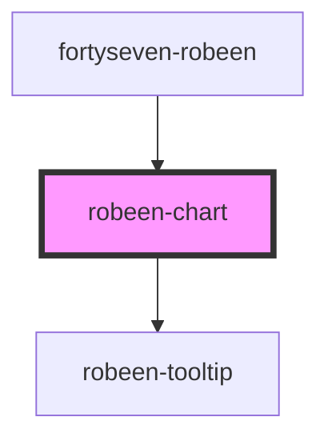

# fortyseven-robeen

<!-- Auto Generated Below -->

## Properties

| Property               | Attribute | Description | Type                                                                                                                                                                                                                                                                                                                                                                                                                            | Default     |
| ---------------------- | --------- | ----------- | ------------------------------------------------------------------------------------------------------------------------------------------------------------------------------------------------------------------------------------------------------------------------------------------------------------------------------------------------------------------------------------------------------------------------------- | ----------- |
| `metrics` _(required)_ | --        |             | `{ benchmark: string; mode: string; primaryMetric: JMHMetric; secondaryMetrics?: object; jmhVersion?: string; threads?: number; forks?: number; jvm?: string; jvmArgs?: (string \| number)[]; jdkVersion?: string; vmName?: string; vmVersion?: string; warmupIterations?: number; warmupTime?: string; warmupBatchSize?: number; measurementIterations?: number; measurementTime?: string; measurementBatchSize?: number; }[]` | `undefined` |

## Dependencies

### Used by

 - [fortyseven-robeen](../robeen)

### Depends on

- [robeen-tooltip](../tooltip)

### Graph

----------------------------------------------

*Built with [StencilJS](https://stenciljs.com/)*
