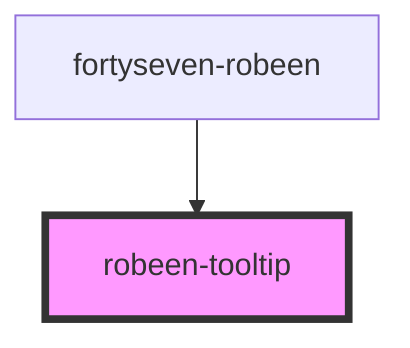

# robeen-tooltip

<!-- Auto Generated Below -->

## Methods

### `hide() => Promise<void>`

#### Returns

Type: `Promise<void>`

### `show(index: number, data: any, positions: number[]) => Promise<void>`

#### Returns

Type: `Promise<void>`

### `tooltip(tooltip: Element) => Promise<void>`

#### Returns

Type: `Promise<void>`

## Dependencies

### Used by

 - [fortyseven-robeen](../chart)

### Graph

----------------------------------------------

*Built with [StencilJS](https://stenciljs.com/)*
